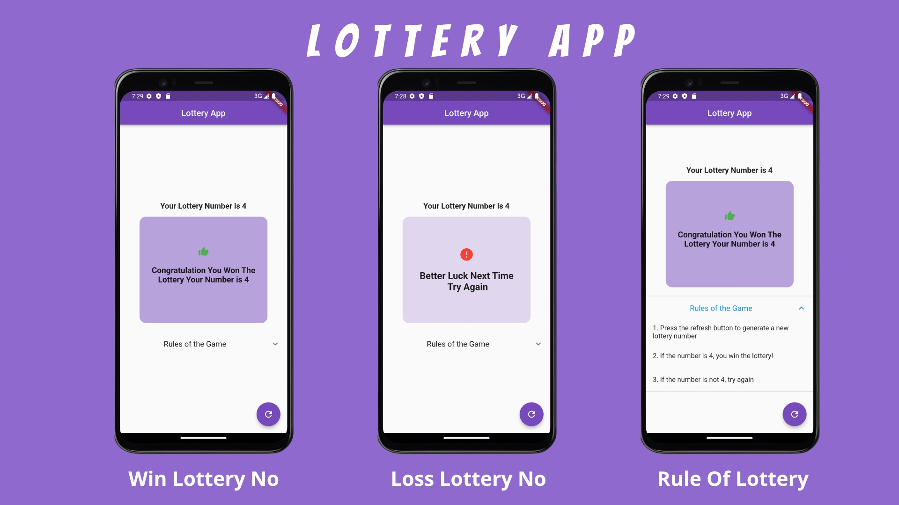

# Lottery_Application
This is a Flutter app that simulates a lottery game. 
When the app is launched, it displays a randomly generated lottery number to the user. 
If the number is 4, the app displays a congratulatory message, and if the number is not 4, the app displays a message encouraging the user to try again. 
The user can generate a new lottery number by clicking the refresh button. The app also includes an expansion tile with the rules of the game.

## Features

>
* Display a randomly generated lottery number.
* Congratulatory message if the number is 4.
* Encouragement to try again if the number is not 4.
* Refresh button to generate a new lottery number.
* Expansion tile with the rules of the game.
>
## Screenshots



## Color Reference

| Color             | Hex                                                                |
| ----------------- | ------------------------------------------------------------------ |
| Amethyst |  #8F69CD |
| White |  #FFFFFF |
| Black |  #000000 |

## Getting Started
To run this app, you will need to have Flutter installed on your machine.

1.  Clone the repository
```flutter
git clone https://github.com/ahsanalisk/Lottery_Application.git
```
2.  Go to the project directory
```flutter
cd Lottery_Application
```
3.  Run the app
```flutter
flutter run
```
## Built With
* Flutter - The mobile development framework used


## Author
Ahsan Ali 

## 🔗 Social Links

[](https://www.linkedin.com/in/ahsansoomro/)
